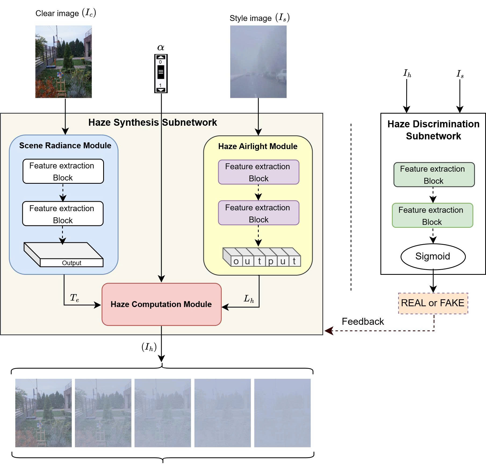

# [Official] PT-Net: A Physics-Aware Transformer Network for Arbitrary Haze Rendering

<p align="center">
    📄 <a href="link-to-your-paper"><b>Paper</b></a>&nbsp;&nbsp; | &nbsp;&nbsp;
    💻 <a href="https://github.com/val-utehy/PT-Net"><b>Source Code</b></a>&nbsp;&nbsp; | &nbsp;&nbsp;
    🤗 <a href="https://huggingface.co/val-utehy/PT-Net"><b>Hugging Face</b></a>
</p>

<p align="center">
    
<p>

<p align="center">
    <em>Architecture of the PT-Net model, utilizing the Physics-Aware Haze Model.</em>
<p>

## Introduction

**PT-Net** is a novel Physics-Aware Transformer Network designed for image-to-image translation, focusing on generating realistic hazy images with arbitrary and continuous haze levels. It provides precise control over haze density based on the physical parameters of the Atmospheric Scattering Model.

### Key Features

*   **Novel haze rendering framework:** We propose PT-Net, a physics-aware transformer-based network designed for continuous  haze synthesis, enabling the generation of realistic and diverse hazy images.
*   **Arbitrary haze generation:** The proposed framework supports the synthesis of images with multiple haze styles (e.g., fog, dust, and sandstorm) and continuously adjustable haze densities by varying the input style image and the haze-level parameter.

## Demo


## Installation and Requirements

To run this model, you need the proper environment. We recommend the following versions:

*   **Python:** `Python >= 3.10` (Recommended `Python 3.10`)
*   **PyTorch:** `PyTorch >= 2.0` (Recommended `PyTorch 2.6.0`)

**Step 1: Clone the repository**

```shell
  git clone https://github.com/val-utehy/PT-Net.git
  cd PT-Net
```

**Step 2: Install dependencies**

```shell
  pip install -r requirements.txt
```

> [!NOTE]
> Make sure you have installed the compatible versions of **torch** and **torchvision** with your **CUDA driver** to leverage GPU.

## Pretrained Models
The pretrained models are available at: [link](https://drive.google.com/drive/folders/1hx9Kb-ZL0B4OCCmkchzxiXrZeca87hKj?usp=sharing).  
> [!NOTE]  
> Put all weights downloaded to [./checkpoints](./checkpoints).  

## Usage Guide

### 1. Model Training

Training file will be updated soon!

### 2. Testing and Inference

**a. Video Processing:**

#### 1. Configure the script file:
Open and edit the file `inference_video.py`. You need to provide the path to the trained checkpoint, input/output video paths, and set the `alpha` parameter to control the change in haze density over time.

#### 2. Run the video processing script:
After completing the configuration, execute the following command (using `inference_video.py`):

> [!NOTE]
> For inference please use weights netG.pt
```shell
    python inference_video.py --cuda 0 --input_video "path/to/video.mp4" --style_dir "path/to/style-image-dir" --ckpt_path "path/to/ckpt-netG/"
```

Eg:
```shell
    python inference_video.py --cuda 0 --input_video "path/to/video.mp4" --style_dir "path/to/style-image-dir" --ckpt_path "checkpoints/epoch_10_netG.pt"
```

**b. Image Directory Processing:**
#### 1. Configure the script file:
Open and edit the file `inference_image.py` . You need to provide the path to the checkpoint, input/output image directory paths, and the $\alpha$ value (or `alpha_list`) to control the haze level.

#### 2. Run the image directory processing script:
After completing the configuration, execute the following command (using `inference_image.py`):

> [!NOTE]
> For inference please use weights netG.pt
```shell
  python inference_image.py --content_dir "path/to/input/content-images" --style_dir "path/to/input/styles-images" --ckpt_path "path/to/ckpt-netG" --output_dir "path/to/output"
```

Eg:
```shell
  python inference_image.py --content_dir "path/to/input/content-images" --style_dir "path/to/input/styles-images" --ckpt_path "checkpoints/epoch_10_netG.pt" --output_dir "path/to/output"
```

## Citation

If you use this source code for your research, please cite our paper (will be updated):

[//]: # (```bibtex)
[//]: # (@article{ptnet2026,)
[//]: # (    title={PT-Net: A Physics-Aware Transformer Network for Arbitrary Haze Rendering},)
[//]: # (    author={...},)
[//]: # (    journal={},)
[//]: # (    year={2026})
[//]: # (})
[//]: # (```)

## References

1. https://github.com/EndlessSora/TSIT

2. https://github.com/astra-vision/CoMoGAN

3. https://github.com/AlienZhang1996/S2WAT


## License
This project is licensed under the MIT License - see the [LICENSE](LICENSE) file for details.
